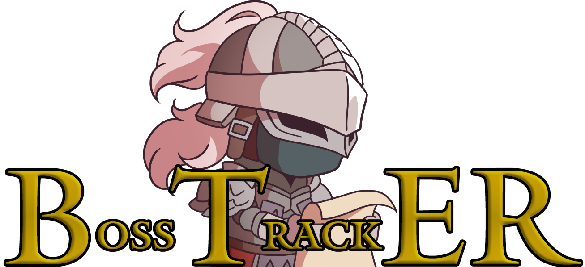
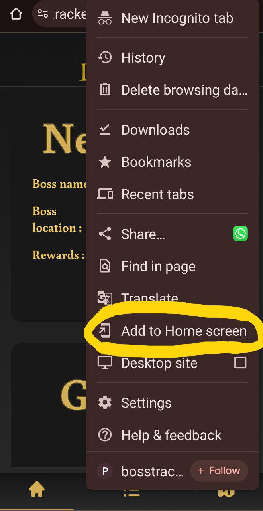
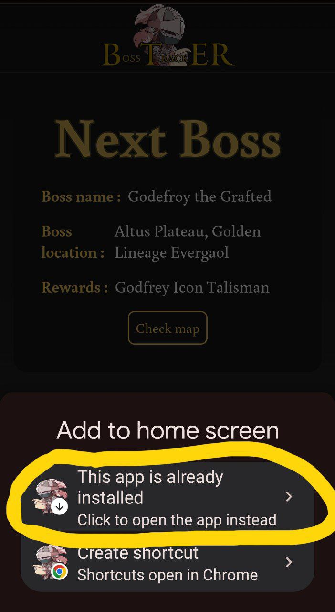

    

# What is it

An Elden Ring Boss tracker, to track the progress of your journey.

See all the bosses that you've killed and the ones that remain.  
Check all of your personal stats like which boss has taken you more tries or what region was the most difficult to complete.  
Once you've completed your run, just like in the game, you can restart all over and compare your performance between all of your previous times you've completed the game.

# How to use it
You can check out the webapp at this <a href="https://bosstracker.pages.dev/">link</a>.  
If your mobile device supports it, you can download the webapp as a mobile app and use it just like a regular mobile application.
Here's the steps to download the app from your phone:  

    
    

# Final Notes

The app is still a work in progress and there's room for a lot of improvements to be made.  
If you have any suggestion on how to improve the application, you can contact me via <a href="https://github.com/LucaFraMacera/BossTrackER/issues">GitHub's issues</a>.

